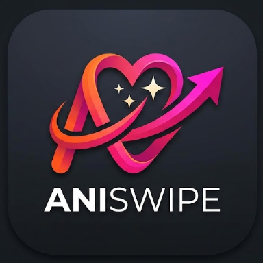
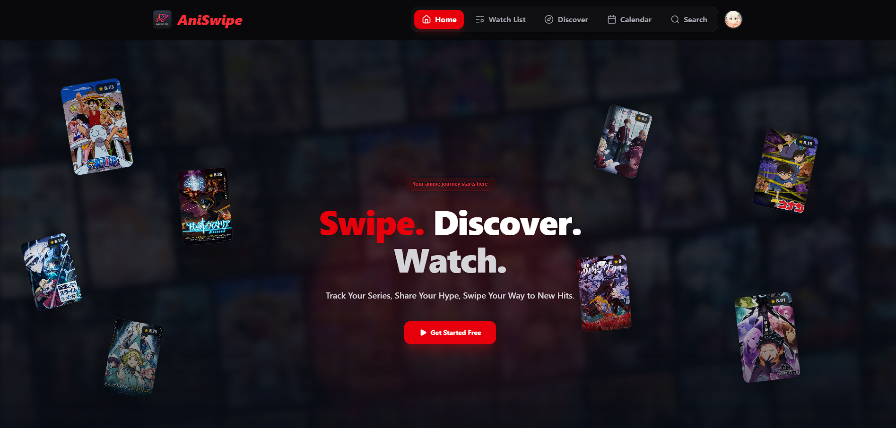
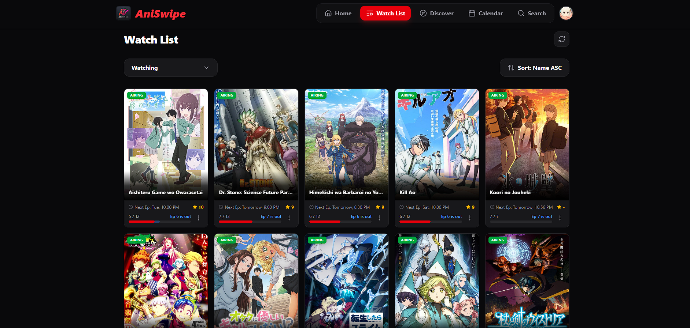
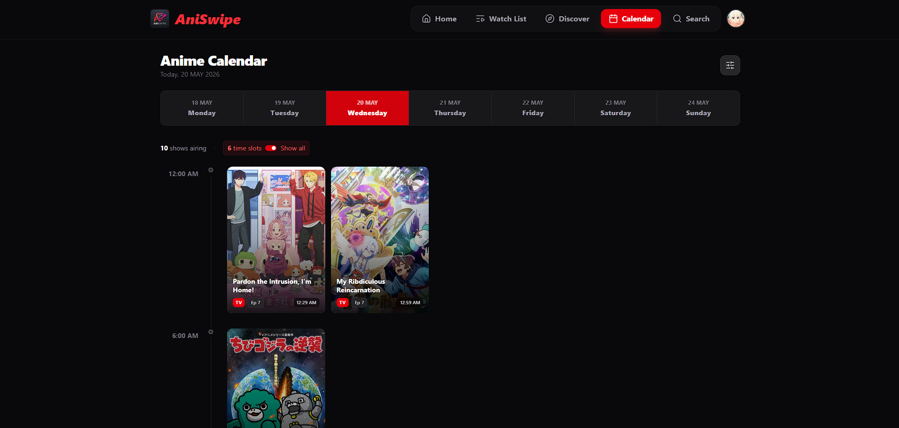
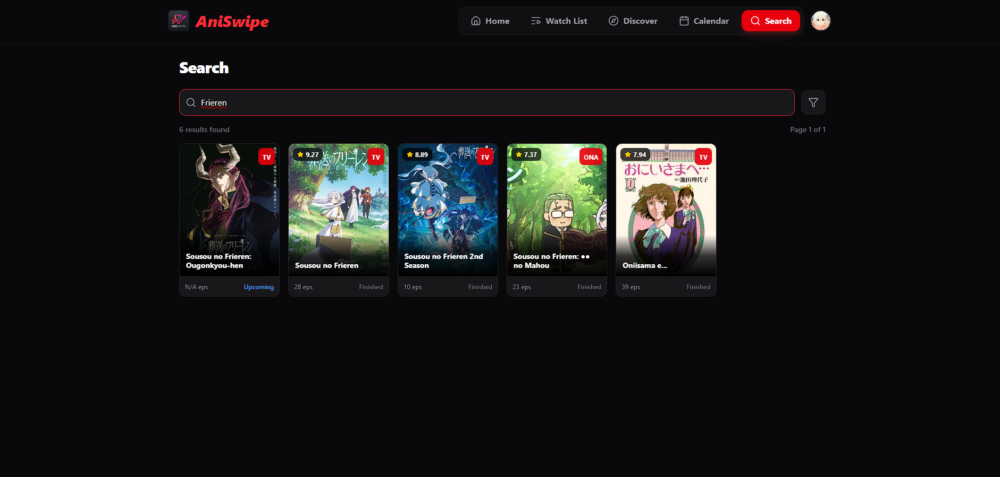
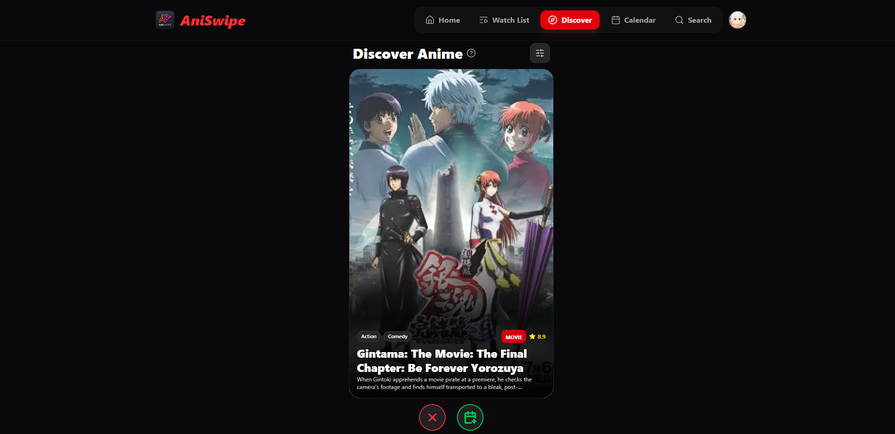

  
  <h1>AniSwipe - Anime List Tracker</h1>
  
Track Your Series, Share Your Hype, Swipe Your Way to New Hits.

  
A swipe-based anime discovery mobile web application designed to help you quickly find and track your next favorite series.

## 📸 Screenshots

  
  

  
  

  

## 🔗 Links
* **Live App:** [AniSwipe Web App](https://aniswipe-three.vercel.app/)
* **Changelog:** [View Changelog](CHANGELOG.md)
* **Releases:** [Download & Release Notes](https://github.com/Soujiro0/aniswipe-releases/releases)

## 🛠️ Tech Stack
* **Frontend:** React.js, Tailwind CSS
* **Backend:** Supabase, Serverless Edge Functions (Custom MyAnimeList API Proxy)

## 🐛 Issue Tracking
Found a bug or have a feature request? Please check the [Issues](https://github.com/Soujiro0/aniswipe-releases/issues) tab to see if it has already been reported, or open a new issue.
