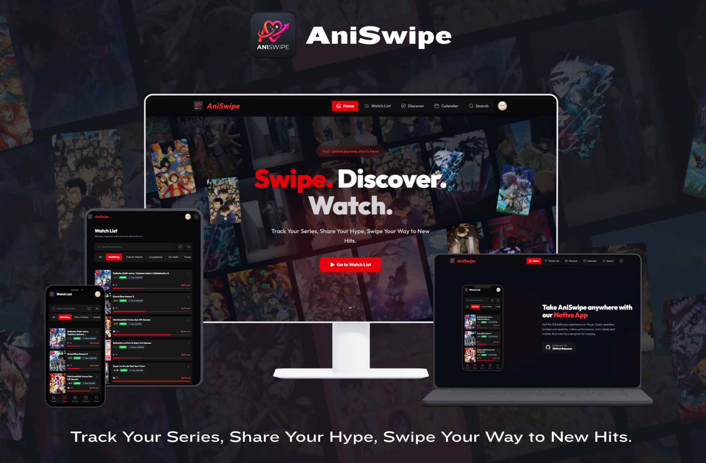
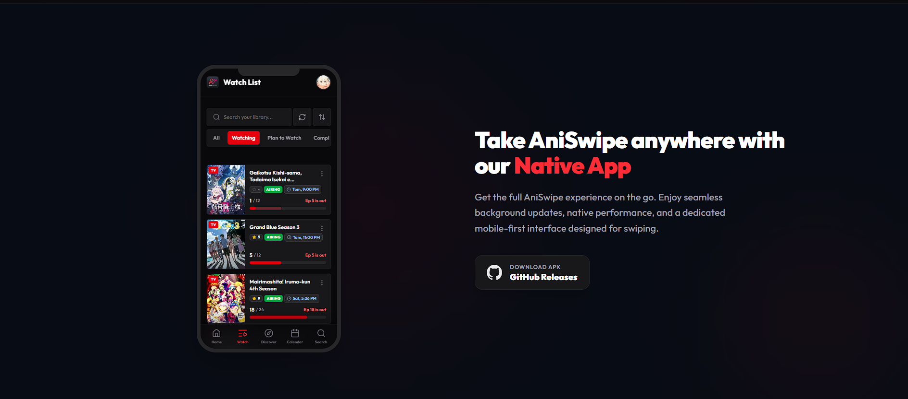

  
  <h1>AniSwipe - Anime List Tracker</h1>
  
Track Your Series, Share Your Hype, Swipe Your Way to New Hits.

   

  <!-- Download APK Button -->
  
  

 

> 📱 **New: Native Android App Now Available!**
> AniSwipe is now available as a native Android app (APK) alongside the web version! Enjoy a smoother swipe experience, faster loading, and a seamless mobile interface designed specifically for your phone.

---

### 😫 Losing track of your watchlist?

Are you tired of trying to track your anime across a dozen different streaming sites? Frustrated because you can't easily find release schedules? Do you constantly forget if you're actually caught up to the latest episode?

**Here in the AniSwipe app, we make being an anime fan effortless.** AniSwipe is a fun, swipe-based discovery and tracking app designed to bring all your anime needs into one organized place.

## ✨ Why You'll Love AniSwipe

- **📱 Swipe to Discover:** Finding your next binge is as easy as swiping. Discover hidden gems, seasonal hits, and tailored recommendations with our fun and intuitive swipe interface.
- **✅ Track Your Progress:** Never ask _"Wait, did I watch episode 12?"_ again. Easily log your current episodes and always know exactly where you left off.
- **📅 Stay on Schedule:** Check release schedules at a glance. Know exactly when your favorite seasonal anime is dropping so you never miss a premiere.
- **📚 Your Ultimate Library:** Build and manage your "Watching," "Completed," and "Plan to Watch" lists all in one place, regardless of which streaming platform you use to actually watch them.

## 📸 See It In Action

  

  

## 🔗 Quick Links & Downloads

- **📲 Download Native Android App:** [Get APK from GitHub Releases](https://github.com/Soujiro0/aniswipe-releases/releases)
- **🚀 Launch Web App:** [Open AniSwipe Web App](https://aniswipe.soujirodev.qzz.io/)
- **📝 What's New:** [Read the Changelog](CHANGELOG.md)

## 🐛 Feedback & Bug Reports

This repository is our public hub for the community! We want to make AniSwipe the best it can be, and your feedback is a huge part of that.

Did you find a bug, or do you have an awesome idea for a new feature? Please check our [Issues board](https://github.com/Soujiro0/aniswipe-releases/issues) to see if someone else has already mentioned it, or feel free to open a new issue. We'd love to hear from you!
